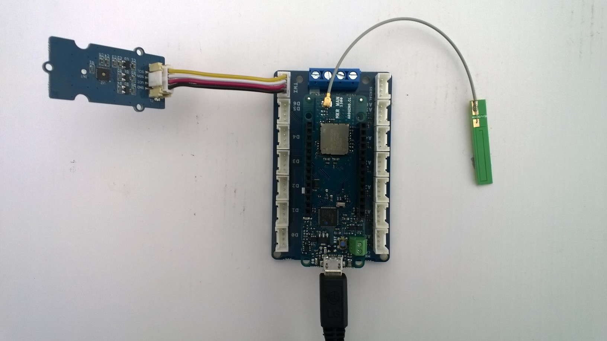

# FieldGateway.LoRa.ArduinoMKRWAN1300Client

Sample [Arduino MKRWAN1300](https://www.arduino.cc/en/Guide/MKRWAN1300) client for my [LoRa](https://lora-alliance.org/) field gateway projects

I used the [Arduino-Lora](https://github.com/sandeepmistry/arduino-LoRa), and [Silicon Labs Si7005](https://github.com/Seeed-Studio/Grove_Temper_Humidity_TH02) libraries, thank you to the authors Sandeep Mistry & Seeedstudio.

My Arduino MKRWAN1300  uses
* [Arduino MKR WAN 1300](https://www.seeedstudio.com/ARDUINO-MKR-WAN-1300-LORA-CONNECTIVIT-p-3164.html)
* [ARDUINO MKR CONNECTOR CARRIER (GROVE COMPATIBLE) ](https://www.seeedstudio.com/ARDUINO-MKR-CONNECTOR-CARRIER-GROVE-COMPATIBL-p-3171.html)
* [SeeedStudio Grove-Temperature & Humidity Sensor ](https://www.seeedstudio.com/Grove-Temperature%26Humidity-Sensor-%28High-Accuracy-%26-Mini%29-p-1921.html)
* [SeeedStudio Grove-Universal 4 Pin Buckled 5cm Cable](https://www.seeedstudio.com/Grove-Universal-4-Pin-Buckled-5cm-Cable-%285-PCs-Pack%29-p-925.html)

